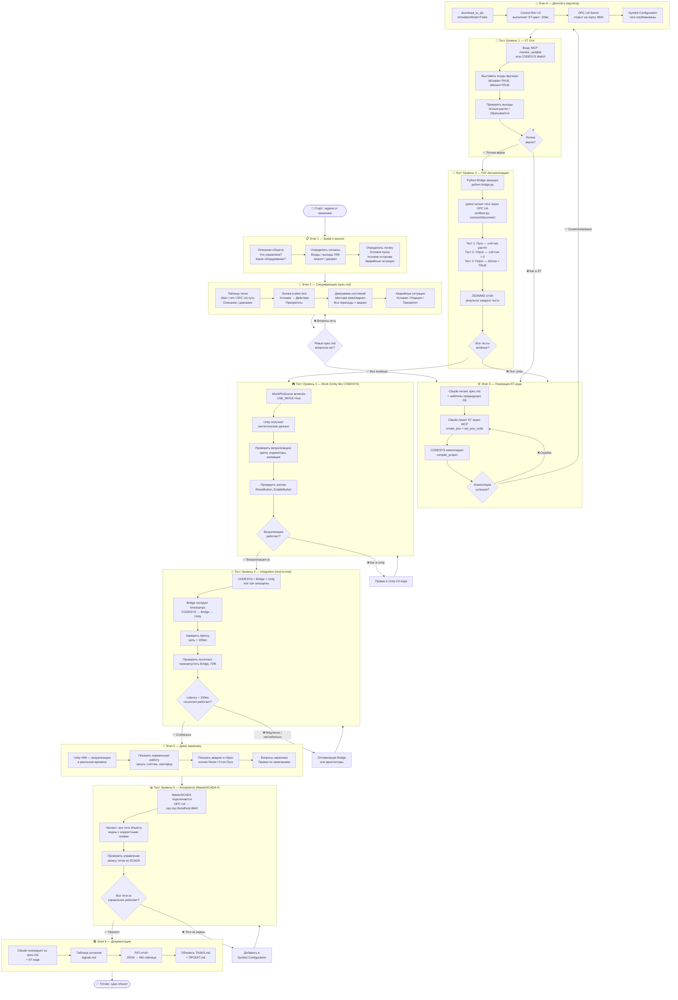

# Бизнес-процесс: от задачи до готового ПО

> Полный цикл: от брифа заказчика → до сдачи проверенного кода с документацией.

---

## Обзорная схема (уровень 1)

```
ВХОД                    ПРОЦЕСС                         ВЫХОД
─────────────────────────────────────────────────────────────────
Задача заказчика   →    Spec.md                    →   ТЗ на FB
Spec.md            →    Claude + MCP + CODESYS     →   ST-код
ST-код             →    Тесты уровней 1–4          →   Проверенный FB
Проверенный FB     →    Демо + MasterSCADA          →   Сданный объект
```

---

## Детальная диаграмма потока



---

## Что на входе и выходе каждого этапа

| Этап | Вход | Инструмент | Выход |
|------|------|-----------|-------|
| **1. Бриф** | Словесное описание задачи | Разговор с заказчиком | Список сигналов, логика в словах |
| **2. Spec** | Список сигналов + логика | Текстовый редактор / Claude | `spec.md`: теги, stateDiagram, аварии |
| **3. Генерация ST** | `spec.md` | Claude + MCP + CODESYS | Скомпилированный FB без ошибок |
| **4. Деплой** | `.project` файл | MCP `download_to_plc` | Control Win V3 работает, OPC UA открыт |
| **Тест Ур.1** | Работающий ПЛК | MCP `monitor_variable` / Watch | Подтверждено: логика верна вручную |
| **Тест Ур.2** | OPC UA Server | Python pytest + asyncua | JSON/MD отчёт: N тестов / N прошли |
| **Тест Ур.3** | `MockPlcSource` | Unity Play mode | Подтверждено: визуализация без CODESYS |
| **Тест Ур.4** | Весь стек вместе | Bridge logs + замер latency | Latency < 100мс, reconnect стабилен |
| **5. Демо** | Unity HMI + стек | Live демо | Замечания заказчика, согласование |
| **Тест Ур.5** | MasterSCADA 4 + OPC UA | Чеклист тегов | Подписан акт приёмки FAT |
| **6. Документация** | spec.md + ST-код + отчёты | Claude | signals.md, FAT-отчёт, обновлённый ПРОЕКТ.md |

---

## Критические точки принятия решений

```
┌─────────────────────┬──────────────────┬───────────────────────────┐
│ Точка               │ Критерий «ОК»    │ Если НЕ ОК — куда идём   │
├─────────────────────┼──────────────────┼───────────────────────────┤
│ Ревью spec.md       │ Нет открытых     │ Уточнить у заказчика /    │
│                     │ вопросов         │ доработать spec           │
├─────────────────────┼──────────────────┼───────────────────────────┤
│ Компиляция ST       │ 0 ошибок         │ Claude правит ST-код      │
├─────────────────────┼──────────────────┼───────────────────────────┤
│ Тест Ур.1 (ST Unit) │ Логика верна     │ Правки в ST через MCP     │
│                     │ вручную          │                           │
├─────────────────────┼──────────────────┼───────────────────────────┤
│ Тест Ур.2 (FAT)     │ 100% тестов      │ Найти баг в ST или        │
│                     │ зелёные          │ в тест-кейсе              │
├─────────────────────┼──────────────────┼───────────────────────────┤
│ Тест Ур.4 (Integration)│ Latency<100мс │ Оптимизировать Bridge     │
│                     │ reconnect ок     │ или polling-интервал      │
├─────────────────────┼──────────────────┼───────────────────────────┤
│ Тест Ур.5 (Acceptance)│ Все теги в     │ Добавить в Symbol Config  │
│                     │ MasterSCADA      │ → перекомпилировать       │
└─────────────────────┴──────────────────┴───────────────────────────┘
```

---

## Время на каждый этап (ориентир)

| Этап | Первый FB | Повторный FB |
|------|-----------|-------------|
| Бриф + анализ | 2–4 ч | 1–2 ч |
| Spec.md | 2–3 ч | 30–60 мин |
| Генерация ST | 15–30 мин | 10–15 мин |
| Тест Ур.1 | 30–60 мин | 15–30 мин |
| Тест Ур.2 (FAT) | 2–4 ч (написать тесты) | 10 мин (запустить) |
| Тест Ур.3 (Mock) | 1–2 ч | 30 мин |
| Тест Ур.4 (Integration) | 1 ч | 15 мин |
| Демо | 1–2 ч | 30–60 мин |
| Тест Ур.5 (Acceptance) | 2–4 ч | 1–2 ч |
| Документация | 30–60 мин | 15–30 мин |
| **Итого** | **~15–25 ч** | **~4–8 ч** |

> **Ключевой момент:** первый FB на объекте — долго, зато шаблон написан. Каждый следующий FB — в 3–5 раз быстрее.

---

## Схема потоков данных (что куда идёт)

```
Заказчик                 Инженер                  Инструменты
────────                 ────────                 ────────────

Бриф        ──────────→  spec.md         ─────→   Claude (читает)
                                                      │
                                                      ↓ MCP
                                              CODESYS (ST-код)
                                                      │
                                                      ↓ OPC UA
                         bridge.py        ←─────  Control Win V3
                              │
                    ┌─────────┼─────────┐
                    ↓         ↓         ↓
                 Unity HMI  pytest   logs/
                 (демо)     (FAT)    (отчёт)
                    │
                    ↓
Заказчик  ←── демо на ноутбуке
                    │
                    ↓
MasterSCADA ←── OPC UA напрямую (Acceptance)
```
