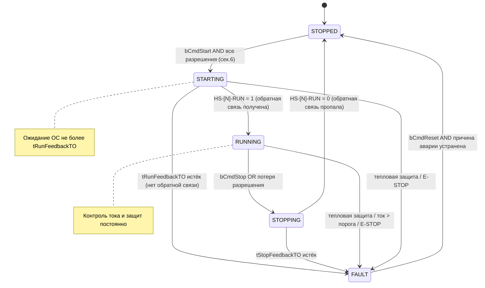

---
# Обязательные поля
tag: ""           # P&ID тег: M-101, P-201, V-301, FV-302
name: ""          # Название: "Шнек дозирования зерна"
type: ""          # motor | valve_onoff | valve_control | conveyor | sensor
fb_name: ""       # Имя Function Block в ST: FB_Shnek, FB_NasosOhlazh

# Опциональные поля
area: ""          # Участок/цех: "Склад зерна", "Котельная"
pid_drawing: ""   # Номер П&ИД чертежа: "П-001-ТМ3"
manufacturer: ""  # Производитель/модель (опционально)
version: "1.0"
author: ""
date: ""

# Профиль типа — какие секции обязательны:
# motor:          1-9, 11 | AO (сек.4) — только если есть ЧРП
# valve_onoff:    1-4, 6-9, 11 | AO, Soft AO — N/A
# valve_control:  1-11 полностью
# conveyor:       1-9, 11 | AI/AO (сек.4) — опционально
# sensor:         1-3, 4.AI, 9, 11 | Сек.6,7 — упрощённо
---

# Спецификация: [tag] — [name]

<!-- Claude: При заполнении по описанию — вывести tag из контекста или спросить.
     Если тип не указан — определить по описанию (мотор/насос/клапан/конвейер/датчик).
     Секции, не применимые к типу, помечать "N/A — [причина]". -->

---

## 1. Карточка оборудования

<!-- Claude: Заполнить из описания. Роль в процессе — одно предложение от технолога. -->

| Поле | Значение |
|---|---|
| **P&ID тег** | [tag] |
| **Тип оборудования** | [Мотор / Насос / Задвижка с/э приводом / Транспортёр / Шнек / Клапан регулирующий / Датчик] |
| **Наименование** | [полное название] |
| **Местоположение** | [цех / участок / позиция] |
| **П&ИД чертёж** | [номер чертежа или N/A] |
| **Производитель/модель** | [марка или N/A] |
| **Роль в процессе** | [одна фраза: что делает для производства] |

---

## 2. Технологический контекст

<!-- Claude: Описать откуда и куда идёт материал/среда. Зачем нужна автоматизация.
     Указать режим работы в общей схеме. -->

**Upstream (что подаётся на вход):**
[откуда берётся материал, среда, энергия — название агрегата/ёмкости]

**Downstream (что выходит):**
[куда уходит продукт/среда — следующий агрегат или конечная точка]

**Зачем автоматизация:**
[что без неё не работает / какие риски без автоматики]

**Режим работы в схеме:**
- [ ] Непрерывный (работает постоянно пока процесс активен)
- [ ] Циклический (запускается по условию, останавливается после выполнения)
- [ ] По команде оператора

---

## 3. Режимы работы

<!-- Claude: Для типа sensor — только ACTIVE/INHIBITED. Для остальных — полный набор.
     Указать особенности каждого режима для конкретного оборудования. -->

| Режим | Код | Описание | Кто управляет |
|---|---|---|---|
| МЕСТНЫЙ | LOCAL | Управление кнопками на местном щите, блокировки от ПЛК игнорируются | Оператор у агрегата |
| ДИСТАНЦИОННЫЙ | REMOTE | Управление по программе ПЛК согласно логике | ПЛК автоматически |
| ТЕХОБСЛУЖИВАНИЕ | MAINT | Тест-режим: команды можно подавать без разрешающих условий | Наладчик |
| АВАРИЯ | FAULT | Защитный останов, требуется ручной сброс | Только сброс оператором |

**Переключение режимов:**
- LOCAL/REMOTE: [физический переключатель HS-XXX-LR / программно через SCADA]
- MAINT: [только через SCADA с паролем / физический ключ]

---

## 4. Полевые сигналы — Физические I/O

<!-- Claude: Вывести теги из P&ID или построить по шаблону: тип-номер-суффикс.
     НО = нормально открытый (0 в покое), НЗ = нормально замкнутый (1 в покое).
     Для типа sensor — только AI, без DO.
     Для valve_onoff — нет AI тока. -->

### DI — Дискретные входы

| Сигнал | Тип | Тег | Описание | Норм. состояние |
|---|---|---|---|---|
| Обратная связь «работает» | DI | HS-[N]-RUN | Контактор/привод включён | НО: 0=стоп, 1=работает |
| Тепловая защита | DI | HS-[N]-THERM | Тепловое реле двигателя | НЗ: 1=OK, 0=сработало |
| Переключатель LOCAL/REMOTE | DI | HS-[N]-LR | Местный/Дистанционный | 1=Дистанционный |
| [доп. сигнал — напр. конечный выключатель] | DI | [тег] | [описание] | [норм.] |

### AI — Аналоговые входы

| Сигнал | Тип | Тег | Диапазон | Единицы | Описание |
|---|---|---|---|---|---|
| Ток двигателя | AI | IE-[N] | 4–20 мА = 0–[Iном] | А | Текущий ток статора |
| [доп. датчик] | AI | [тег] | [диапазон] | [ед.] | [описание] |

### DO — Дискретные выходы

| Сигнал | Тип | Тег | Описание |
|---|---|---|---|
| Команда пуска / останова | DO | KA-[N] | Катушка силового контактора |
| [доп. выход] | DO | [тег] | [описание] |

### AO — Аналоговые выходы

<!-- Claude: Для типа motor без ЧРП — заменить на "N/A — нет частотного привода". -->

| Сигнал | Тип | Тег | Диапазон | Описание |
|---|---|---|---|---|
| Задание скорости (ЧРП) | AO | SE-[N] | 4–20 мА = 0–50 Гц | Задание частоты вращения |

---

## 5. Программные сигналы — Soft I/O

<!-- Claude: Имена переменных — латиница, camelCase с префиксом типа (b=BOOL, r=REAL, n=INT).
     Для типа sensor — нет входных команд, только выходные значения. -->

### Входы (команды от программы/SCADA)

| Переменная | Тип ST | Описание |
|---|---|---|
| bCmdStart | BOOL | Команда пуска (передний фронт) |
| bCmdStop | BOOL | Команда останова |
| bCmdReset | BOOL | Сброс аварии (передний фронт) |
| rSpeedSP | REAL | Задание скорости 0.0–100.0 % (если ЧРП) |
| [bInterlock_XXX] | BOOL | [технологическая блокировка от соседнего FB] |

### Выходы (статус для программы/SCADA/HMI)

| Переменная | Тип ST | Описание |
|---|---|---|
| bRunning | BOOL | TRUE = агрегат работает |
| bStopped | BOOL | TRUE = агрегат остановлен и готов |
| bFault | BOOL | TRUE = авария активна |
| bReady | BOOL | TRUE = можно подать команду пуска |
| nState | INT | Код состояния: 0=СТОП, 1=ПУСК, 2=РАБОТА, 3=ОСТАНОВ, 4=АВАРИЯ |
| rCurrentA | REAL | Текущий ток (А), из AI IE-[N] |
| rRunHours | REAL | Наработка (моточасы) |

---

## 6. Условия пуска и блокировки (Interlocks)

<!-- Claude: Разрешающие условия = логика AND (все должны быть TRUE).
     Защитные блокировки = логика OR (любая → останов).
     Вывести из технологического контекста (секция 2) + стандартные для типа. -->

### Разрешающие условия пуска (пермиссивы)

Пуск разрешён только если **ВСЕ** условия выполнены:

- [ ] Нет активных аварий (`bFault = FALSE`)
- [ ] Режим ДИСТАНЦИОННЫЙ (`HS-[N]-LR = 1`)
- [ ] [Downstream агрегат запущен] (`FB_XXX.bRunning = TRUE`)
- [ ] [Upstream условие: уровень > мин.] (`rLevel_[N] > [порог]`)
- [ ] [Добавить технологические условия]

### Защитные блокировки (мгновенный останов)

При срабатывании **ЛЮБОЙ** — немедленно отключить:

- Тепловая защита: `HS-[N]-THERM = 0`
- Перегрузка по току: `IE-[N] > [Iном × 1.1]` А
- Аварийная кнопка E-STOP (аппаратная, вне ПЛК)
- [Технологическая блокировка: описание]

---

## 7. Диаграмма состояний

<!-- Claude: Для типа sensor — заменить на "N/A — датчик не имеет состояний машины".
     Для valve_onoff — CLOSED/OPENING/OPEN/CLOSING/FAULT.
     Для motor/conveyor — стандартная ниже. Добавить специфику из секции 6. -->

**Коды состояний (nState):**

| Код | Имя | Описание |
|---|---|---|
| 0 | STOPPED | Остановлен, готов к пуску |
| 1 | STARTING | Команда подана, ожидание обратной связи |
| 2 | RUNNING | Работает, все защиты активны |
| 3 | STOPPING | Команда останова, ожидание остановки |
| 4 | FAULT | Авария, требуется сброс |

---

## 8. Таймеры

<!-- Claude: Для valve_onoff — tOpenTO/tCloseTO вместо RunFeedback/StopFeedback.
     Значения по умолчанию — типовые для промышленного оборудования.
     Уточнить у технолога или оставить как рекомендованные. -->

| Таймер | Переменная ST | Назначение | Время (сек) | Примечание |
|---|---|---|---|---|
| Задержка пуска | tStartDelay | Пауза перед подачей KA-[N] | 2 | Защита от частых включений |
| Таймаут обратной связи пуска | tRunFeedbackTO | STARTING→FAULT если нет HS-RUN | 10 | Типово 5–15 с |
| Таймаут останова | tStopFeedbackTO | STOPPING→FAULT если есть HS-RUN | 15 | Типово 10–20 с |
| Задержка фиксации аварии | tFaultDelay | Дребезг при токовой перегрузке | 0.5 | Избежать ложных срабатываний |
| Наработка до ТО | tMaintenanceHours | Предупреждение оператору | 2000 ч | Конфигурируется |

---

## 9. Аварии и предупреждения

<!-- Claude: Тег аварии = A-[N]-NN (авария) или W-[N]-NN (предупреждение).
     Приоритет: КРИТИЧЕСКИЙ (немедленный останов), ВЫСОКИЙ (требует действия), НИЗКИЙ (информация).
     Сброс: Ручной (оператор нажимает Reset) или Авто (исчезает когда причина устранена). -->

| Тег | Сообщение | Приоритет | Причина | Действие оператора | Сброс |
|---|---|---|---|---|---|
| A-[N]-01 | Нет ОС пуска [name] | ВЫСОКИЙ | HS-[N]-RUN не пришёл за tRunFeedbackTO | Проверить контактор, автомат, цепь ОС | Ручной |
| A-[N]-02 | Тепловая защита [name] | ВЫСОКИЙ | HS-[N]-THERM = 0 | Проверить двигатель, дать остыть 15 мин | Ручной |
| A-[N]-03 | Перегрузка по току [name] | ВЫСОКИЙ | IE-[N] > [Iном×1.1] А | Проверить нагрузку на валу, механику | Ручной |
| A-[N]-04 | Нет ОС останова [name] | ВЫСОКИЙ | HS-[N]-RUN не пропал за tStopFeedbackTO | Проверить контактор, механику | Ручной |
| W-[N]-01 | Моточасы [name] > нормы ТО | НИЗКИЙ | rRunHours > tMaintenanceHours | Запланировать ТО | Авто |

---

## 10. Требования к HMI / SCADA

<!-- Claude: Цвета — стандарт ISA-101. Указать теги OPC UA для каждого отображаемого значения.
     Теги OPC UA формат: Application.[fb_name].[переменная] -->

### Отображение на мнемосхеме П&ИД

| Элемент | Условие | Цвет/Вид |
|---|---|---|
| Символ агрегата | nState = 2 (RUNNING) | Зелёный |
| Символ агрегата | nState = 4 (FAULT) | Красный мигающий |
| Символ агрегата | nState = 0 (STOPPED) | Серый |
| Символ агрегата | nState = 1,3 (переходные) | Жёлтый |
| Значение тока | Всегда | rCurrentA [А] |
| Индикатор аварии | bFault = TRUE | Красный треугольник |

**Теги OPC UA:** `Application.[fb_name].nState`, `Application.[fb_name].bFault`, `Application.[fb_name].rCurrentA`

### Управление оператором (в режиме REMOTE)

- Кнопка **Пуск** → `bCmdStart`
- Кнопка **Стоп** → `bCmdStop`
- Кнопка **Сброс аварии** → `bCmdReset`
- Ввод задания скорости (если ЧРП) → `rSpeedSP`
- Переключатель LOCAL/REMOTE: физический HS-[N]-LR

### Тренды (архивирование)

- `rCurrentA` — ток (А), интервал 1 с
- `nState` — состояние, по изменению
- `rRunHours` — наработка, интервал 1 мин

---

## 11. FAT-сценарии (приёмо-сдаточные испытания)

<!-- Claude: Каждый сценарий должен быть автоматизирован через OPC UA (pytest + asyncua).
     Действие = запись через monitor_variable (write).
     Проверка = чтение nState или bFault через OPC UA.
     Симуляция полевых сигналов — через monitor_variable на входные переменные FB. -->

| # | Сценарий | Предусловие | Действие | Ожидаемый результат | Авто-тест |
|---|---|---|---|---|---|
| FAT-01 | Нормальный пуск | Все разрешения OK, режим REMOTE, нет аварий | Записать `bCmdStart=TRUE`, симулировать `HS-[N]-RUN=1` через 1с | `nState=2` (RUNNING) в течение `tRunFeedbackTO` | ✅ |
| FAT-02 | Пуск при активной аварии | `bFault=TRUE` | Записать `bCmdStart=TRUE` | `nState` остаётся 0, `bReady=FALSE` | ✅ |
| FAT-03 | Пуск без разрешения | Разрешение downstream не выполнено | Записать `bCmdStart=TRUE` | `nState` остаётся 0 | ✅ |
| FAT-04 | Аварийный останов тепловой защитой | `nState=2` (RUNNING) | Симулировать `HS-[N]-THERM=0` | `nState=4` (FAULT), `bFault=TRUE`, авария A-[N]-02 | ✅ |
| FAT-05 | Перегрузка по току | `nState=2` (RUNNING) | Симулировать `IE-[N] > Iном×1.1` | `nState=4` (FAULT), `bFault=TRUE`, авария A-[N]-03 | ✅ |
| FAT-06 | Сброс аварии | `nState=4`, причина устранена | Восстановить сигнал, записать `bCmdReset=TRUE` | `nState=0` (STOPPED), `bFault=FALSE` | ✅ |
| FAT-07 | Таймаут обратной связи пуска | Разрешения OK | `bCmdStart=TRUE`, НЕ симулировать HS-RUN | `nState=4` (FAULT) через `tRunFeedbackTO` секунд, авария A-[N]-01 | ✅ |
| FAT-08 | Нормальный останов | `nState=2` (RUNNING) | `bCmdStop=TRUE`, симулировать `HS-[N]-RUN=0` через 1с | `nState=0` (STOPPED) | ✅ |

---

## Примечания и особенности

<!-- Claude: Указать специфику конкретного оборудования, не вошедшую в стандартные секции.
     Например: реверс, ступенчатый пуск, блокировки от соседних FB, особые условия. -->

- [особенность 1]
- [особенность 2]

---

*Версия шаблона: 2.0 | Для CODESYS SP17 + Python Bridge OPC UA*
