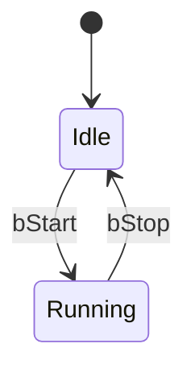

# Эмулятор АСУТП Unity

> Система тестирования и демонстрации ST-кода для CODESYS. Инженер проверяет логику ПЛК на ноутбуке — до выезда на объект.

Рабочая доска задач: [TASKS.md](TASKS.md) | Бизнес-процесс: [docs/business-process.md](docs/business-process.md)

---

## 1. Проблема и решение

### Без эмулятора

В АСУ ТП проектах ST-код пишется и тестируется впервые на объекте — во время пусконаладки. Это означает:

- Баги обнаруживаются под давлением времени, при живом оборудовании
- FAT (Factory Acceptance Test) проводится формально или не проводится вовсе
- Заказчик не видит работу системы до момента монтажа
- Документация пишется постфактум или не пишется совсем
- Онбординг нового инженера — только «смотри и запоминай»

### С эмулятором

| Кто | Что получает |
|-----|-------------|
| Инженер-разработчик | Пишет код быстрее (Claude генерирует ST из spec), тестирует локально |
| Инженер-наладчик | Проходит FAT на стенде, приезжает на объект с проверенным кодом |
| Заказчик | Видит работу системы в Unity HMI или своей SCADA до монтажа |
| Руководитель проекта | Документация генерируется автоматически из spec + ST-кода |

### Ключевой результат

ST-код протестирован, задокументирован и показан заказчику — до выезда на объект.

---

## 2. Бизнес-процесс

| Шаг | Инструмент | Результат |
|-----|-----------|-----------|
| 1. Spec | Инженер пишет `spec.md` (теги, логика, stateDiagram, аварии) | Формализованное ТЗ на FB |
| 2. Генерация ST | Claude читает spec → пишет ST через MCP → CODESYS компилирует | Скомпилированный FB без ошибок |
| 3. Запуск | `download_to_plc` (simulationMode=False) → Control Win V3 работает | ПЛК выполняет цикл, OPC UA Server активен |
| 4. FAT | Python pytest → OPC UA → проверяет логику → JSON/MD отчёт | Задокументированный результат теста |
| 5. Демо | Unity HMI показывает заказчику визуализацию в реальном времени | Наглядное демо без выезда на объект |
| 6. SCADA | MasterSCADA 4 подключается напрямую к OPC UA | Заказчик работает в своём ПО с живыми данными |
| 7. Документация | Claude генерирует из spec.md + ST-кода | Актуальная документация к сдаче |

---

## 3. Архитектура

```
┌─────────────────────────────────────────────────────────┐
│  Claude Code (AI + MCP codesys_local)                   │
│  Пишет ST-код, компилирует, загружает в runtime         │
└────────────────────┬────────────────────────────────────┘
                     │ IEC 61131-3 ST, .project файл
                     ▼
┌─────────────────────────────────────────────────────────┐
│  CODESYS Control Win V3  (SoftPLC)                      │
│  Выполняет ST-логику, цикл ~20мс                        │
│  OPC UA Server  opc.tcp://localhost:4840                 │
└──────────┬──────────────────────────┬───────────────────┘
           │ OPC UA  (одна сессия)    │ OPC UA (напрямую)
           │ polling 200мс + запись   │
           ▼                          ▼
┌──────────────────────────┐  ┌──────────────────────────┐
│  Python Bridge           │  │  MasterSCADA 4           │
│  bridge.py               │  │  SCADA заказчика         │
│  asyncua  — читает теги  │  └──────────────────────────┘
│  websockets — broadcast  │
└────────────┬─────────────┘
             │ WebSocket  ws://localhost:8765
             │ JSON: tag_update / write_tag / write_ack
             ▼
  ┌──────────────────┐   ┌──────────────────────────────┐
  │  Unity HMI       │   │  FAT automation              │
  │  2D/3D           │   │  pytest + asyncua            │
  │  визуализация,   │   │  (в разработке)              │
  │  кнопки          │   └──────────────────────────────┘
  └──────────────────┘
```

### Что передаётся по каждой стрелке

| Стрелка | Протокол | Направление | Содержимое |
|---------|---------|-------------|-----------|
| Claude → CODESYS | Файловая система + MCP | Claude пишет | .project файл с ST-кодом |
| CODESYS → Python | OPC UA (TCP 4840) | Polling 200мс | Значения тегов (NodeId → значение) |
| Python → CODESYS | OPC UA | По команде | Запись значения (только whitelist тегов) |
| Python → Unity | WebSocket (8765) | Broadcast | JSON: `tag_update`, `initial_snapshot` |
| Unity → Python | WebSocket (8765) | По событию кнопки | JSON: `write_tag` |
| MasterSCADA → CODESYS | OPC UA (TCP 4840) | Напрямую | Подписка на теги, запись |

### Обоснование архитектурных решений

**Почему OPC UA, а не Modbus.** OPC UA даёт структурированные данные с именами тегов, встроенную типизацию и self-описание сервера. Modbus — регистры без семантики, адреса маппировать вручную. CODESYS экспортирует теги по OPC UA из коробки через Symbol Configuration.

**Почему Python Bridge, а не прямое подключение Unity к OPC UA.** OPC UA C# SDK в Unity создаёт проблемы с IL2CPP компиляцией. Python Bridge изолирует Unity от деталей OPC UA — Unity работает только с простым WebSocket/JSON. Bridge также обеспечивает mock-режим: Unity тестируется без запущенного CODESYS.

**Почему WebSocket, а не HTTP polling.** WebSocket — push-модель: Bridge отправляет обновление в момент изменения тега, без лишних запросов. Двусторонняя связь (команды из Unity в CODESYS) нативна для WebSocket.

**Почему MasterSCADA напрямую к CODESYS OPC UA.** MasterSCADA 4 — нативный OPC UA клиент. Прямое подключение без посредника означает, что заказчик тестирует именно то, что будет на объекте.

---

## 4. Компоненты

| Компонент | Роль | Как запустить |
|-----------|------|---------------|
| CODESYS Control Win V3 | ST runtime + OPC UA Server (порт 4840) | Системный сервис, стартует автоматически. Проект: `C:\Users\Mike\Documents\TestPLC\TestPLC.project` |
| Claude Code + MCP `codesys_local` | Написание ST-кода, компиляция, загрузка в runtime | `claude` в папке проекта. MCP-сервер запускается автоматически из `~/.claude.json` |
| Python Bridge | OPC UA клиент (asyncua) + WebSocket сервер (порт 8765) | `cd python-bridge && python bridge.py` |
| Unity HMI | 2D визуализация состояния ПЛК, кнопки управления | Открыть проект `unity/AsutpEmulator` в Unity 2022 LTS, нажать Play |
| MasterSCADA 4 | SCADA заказчика (финальная система) | Подключить OPC UA клиент к `opc.tcp://localhost:4840` |

### Python Bridge: WebSocket протокол

Bridge слушает на `ws://localhost:8765`. Все сообщения — UTF-8 JSON.

**Сервер → клиент (Unity):**

```json
// При подключении нового клиента — снимок всех текущих значений
{ "type": "initial_snapshot", "tags": { "counter.count": "3", "svetofor.state": "Green" } }

// При изменении любого тега (polling обнаружил отличие от предыдущего значения)
{ "type": "tag_update", "tag_id": "svetofor.state", "value": "Red", "timestamp": 1700000000.0, "quality": "good" }

// Подтверждение записи
{ "type": "write_ack", "request_id": "uuid", "tag_id": "plc.reset", "ok": true }
```

**Клиент → сервер (Unity):**

```json
// Команда записи тега — разрешены только теги из whitelist
{ "type": "write_tag", "request_id": "uuid", "tag_id": "plc.reset", "value": "True" }
```

Whitelist записываемых тегов: `plc.reset`, `plc.threshold`.

### Важно: обход перезаписи ПЛК

ПЛК перезаписывает переменные каждый цикл (~20мс). Прямая запись `bEnable` из Unity невозможна — ПЛК немедленно перезапишет значение. Текущие workaround:

| Тег | Переменная ПЛК | Поведение | Применение |
|-----|---------------|-----------|-----------|
| `plc.reset` | `bSbros` | Одноцикловая запись: ПЛК сам сбрасывает в `False` | Кнопка Reset |
| `plc.threshold` | `nPorog` | ПЛК не перезаписывает `nPorog` | Стоп (=0) / Пуск (=5) |

Правильное решение — добавить `bCmdStart` в Symbol Configuration и управлять через него (см. Открытые вопросы).

---

## 5. Технический стек

| Слой | Технология | Версия |
|------|-----------|--------|
| ST Runtime | CODESYS Control Win V3 | SP17 (3.5.17.30) |
| Язык ПЛК | Structured Text, IEC 61131-3 | — |
| AI + MCP | Claude Code + codesys-mcp-toolkit | npm global |
| OPC UA клиент | asyncua (Python) | — |
| OPC UA аутентификация | Anonymous | — |
| WebSocket сервер | websockets (Python) | — |
| Unity HMI | Unity + NativeWebSocket (C#) | 2022 LTS |
| SCADA заказчика | MasterSCADA 4 | — |
| FAT автоматизация | Python asyncio + pytest | в разработке |
| Версионирование | Git | — |
| Документация | Markdown + Claude (из spec.md + ST) | — |

---

## 6. Соглашения и шаблоны

### 6.1 Именование тегов OPC UA

```
объект.переменная    →   svetofor.state, counter.count
plc.команда          →   plc.reset, plc.threshold
```

Теги регистрируются в словаре `TAGS` в `python-bridge/bridge.py`. Добавление нового тега — одна строка в словаре + запись в Symbol Configuration CODESYS.

### 6.2 Комментарии в ST-коде — только транслит

CODESYS SP17 использует Windows-1251. Кириллица в комментариях превращается в иероглифы.

```
// Sbros schyotchika          <- правильно
// Vklyuchenie nasosa         <- правильно
// Сброс счётчика             <- НЕПРАВИЛЬНО — иероглифы в SP17
```

### 6.3 Структура репозитория

```
/specs              — spec.md для каждого FB (теги, логика, stateDiagram)
/codesys            — бэкап server.js, restore-mcp.bat
/python-bridge      — bridge.py (единый файл моста)
/unity              — Unity проект AsutpEmulator
/docs               — диаграммы, отчёты FAT, экспорты
TASKS.md            — рабочая доска (SMART-задачи, итерации)
ПРОЕКТ.md           — этот файл
CLAUDE.md           — инструкции для Claude Code
```

### 6.4 Шаблон spec.md

Каждый FB описывается в `/specs/имя_объекта/FB_Имя.md`:

```markdown
# FB_Имя — v0.1 — ГГГГ-ММ-ДД

## Теги
| Тег | Тип | OPC UA путь | Описание |
|-----|-----|-------------|---------|

## Логика
Условие → Действие (plain text)

## Диаграмма состояний


## Аварийные ситуации
| Авария | Условие | Реакция |
|--------|---------|---------|
```

### 6.5 Добавление нового тега в стек

1. Добавить переменную в ST-код FB или PLC_PRG
2. Добавить тег в Symbol Configuration CODESYS (Online → Symbol Configuration)
3. Добавить строку в словарь `TAGS` в `python-bridge/bridge.py`
4. Если тег должен быть записываемым — добавить в `WRITABLE_TAGS`
5. Перезапустить `bridge.py`

---

## 7. Тестирование

### Уровни тестирования

| Уровень | Название | Инструмент | Когда |
|---------|---------|-----------|-------|
| 1 | ST Unit | MCP `monitor_variable` / CODESYS Watch | Сразу после генерации ST |
| 2 | FAT Automation | pytest + asyncua (OPC UA) | После настройки OPC UA |
| 3 | Mock Tests | `MockPlcSource` → Unity WebSocket | Разработка Unity без CODESYS |
| 4 | Integration | End-to-end с замером latency | Milestone |
| 5 | Acceptance | MasterSCADA 4 чеклист сигналов | Перед сдачей заказчику |

### Уровень 1 — ST Unit

Проверка логики FB в изоляции. Входы выставляются через MCP `monitor_variable` или CODESYS Watch. Выходы проверяются вручную или скриптом.

Пример для `FB_Counter`: выставить `bEnable=TRUE` → убедиться что `nCount` растёт; выставить `bReset=TRUE` → убедиться что `nCount=0`.

### Уровень 2 — FAT Automation

Структура тестов:

```
/python-bridge/
    tests/
        conftest.py          — фикстуры: connect/disconnect OPC UA, teardown
        test_fb_counter.py   — тест счётчика (шаблон)
        test_fb_shnek.py     — тест шнека дозирования
```

Формат каждого теста (ДАНО / КОГДА / ТОГДА):

```python
async def test_motor_start(plc):
    """
    ДАНО:  шнек остановлен
    КОГДА: подаём команду пуска
    ТОГДА: через 3с скорость > 1400 об/мин
    """
    await plc.write("Shnek.bStart", "FALSE")
    await asyncio.sleep(0.5)
    assert await plc.read("Shnek.nSpeed") == 0

    await plc.write("Shnek.bStart", "TRUE")
    await asyncio.sleep(3)
    assert await plc.read("Shnek.nSpeed") > 1400
```

Отчёт: `pytest --json-report` → JSON → Claude оформляет в MD-таблицу с результатами.

### Уровень 3 — Mock Tests

`MockPlcSource` генерирует синтетические данные по заданному сценарию. Unity подключается к mock через тот же WebSocket — не знает разницы. Переключение: `USE_MOCK=true` в конфиге.

Применение: тестировать анимации, индикаторы аварий, кнопки — без запущенного CODESYS.

### Уровень 4 — Integration

Полный pipeline: CODESYS запущен → Python Bridge логирует timestamps → Unity получает данные. Критерий: latency CODESYS → Unity < 100мс.

### Уровень 5 — Acceptance (MasterSCADA 4)

Чеклист: все теги объекта видны в MasterSCADA 4 с корректными значениями и типами. Проводится вместе с заказчиком до выезда на объект.

---

## 8. Целевые объекты

| Объект | Задача | Статус |
|--------|--------|--------|
| TestPLC | Тестовый стенд: FB_Counter + FB_Svetofor. Проверка всего стека end-to-end. | ✅ В работе |
| Увелка | Шнек дозирования. FB_Shnek: пуск/останов, авария. | ⬜ Итерация 1 |
| Зэла | TBD | ⬜ Бэклог |

### Как добавить новый объект

1. Написать `spec.md` в `/specs/имя_объекта/FB_Имя.md`
2. Claude генерирует FB через MCP → компиляция → `download_to_plc`
3. Добавить теги в `TAGS` (bridge.py) + Symbol Configuration CODESYS
4. Добавить компонент в Unity сцену (новый GameObject + C#-скрипт)
5. Написать FAT-тест в `python-bridge/tests/test_fb_имя.py`

---

## 9. Задачи

> Детальные формулировки — в [TASKS.md](TASKS.md). Обновлять оба файла синхронно.

### Итерация 0 — MCP инфраструктура ✅

- ✅ T-001 Установить codesys-mcp-toolkit, подключить к Claude Code
- ✅ T-001a Расширить MCP: `manage_library`, `get_codesys_log`, `download_to_plc`
- ✅ T-001b TestPLC: FB_Counter + PLC_PRG, запущен в эмуляторе
- ✅ T-002 Git-репозиторий, структура папок
- ✅ T-003 Шаблон spec.md

### Итерация 2 — Python Bridge ✅

- ✅ T-PY-01 Лицензия OPC UA подтверждена
- ✅ T-PY-02 OPC UA включён; Symbol Configuration в TestPLC; Python читает теги
- ✅ T-ARCH-01 Архитектура Python Bridge — ADR-001, C4 L1-L3, протокол, failure modes
- ✅ T-PY-03b OpcUaSource — asyncua polling 200мс, change detection
- ✅ T-PY-03c WsServer — broadcast всем Unity клиентам, initial_snapshot
- ✅ T-PY-03d WriteDispatcher — whitelist, write_ack
- ✅ T-PY-04 Unity NativeWebSocket + PLCBridge.cs — counter.count в реальном времени
- ✅ T-PY-05 End-to-end тест: CODESYS → Python → Unity — счётчик работает
- ✅ T-DEMO-01 FB_Svetofor: Red/Yellow/Green по таймеру; тег `svetofor.state` читается Bridge
- ✅ T-DEMO-02 Unity светофор + кнопки Reset/Стоп-Пуск: TrafficLight.cs, двусторонняя связь

### Бэклог — Итерация 2 (продолжение)

- ⬜ T-PY-03a `tags.yaml` — теги TestPLC с node_id; инженер добавляет теги без правки кода
- ⬜ T-PY-06 MockPlcSource — `USE_MOCK=true`; Unity без запущенного CODESYS
- ⬜ T-PY-07 FAT автоматизация: `conftest.py` + `test_fb_counter.py` (3 теста, JSON/MD отчёт)

### Бэклог — Итерация 0a (Проектирование)

- ⬜ T-005 Шаблон `signals.md` (таблица тегов для передачи заказчику)
- ⬜ T-006 LikeC4: архитектурная диаграмма → PNG в `/docs/`
- ⬜ T-007 spec.md: Mermaid stateDiagram + секция аварийных ситуаций

### Бэклог — Итерация 1 (Шнек дозирования Увелка)

- ⬜ T-009 Полный spec.md для FB_Shnek (7-10 тегов, логика, stateDiagram, аварии)
- ⬜ T-012 Claude генерирует FB_Shnek через MCP
- ⬜ T-013 OPC UA теги FB_Shnek
- ⬜ T-014 Unity сцена П&ИД шнека
- ⬜ T-015 PLCBridge.cs двусторонняя связь шнека
- ⬜ T-016 FAT-скрипт шнека (5 тестов)
- ⬜ T-017 Документация FB_Shnek

---

## 10. Открытые вопросы

| Вопрос | Статус |
|--------|--------|
| `bCmdStart` в Symbol Configuration — добавить, чтобы убрать workaround с `nPorog` | ❓ не сделано |
| NativeWebSocket на IL2CPP — проверить при сборке под Android/Windows standalone | ❓ не проверено |
| Формат отчёта FAT — JSON, MD или PDF? Что ожидает заказчик как документ приёмки? | ❓ не решено |
| Нужен ли ПРОЕКТ.md заказчику или только для внутреннего использования? | ❓ не решено |
| При 100+ тегах polling 200мс по одному — рассмотреть OPC UA subscriptions вместо polling | ⬜ бэклог |
